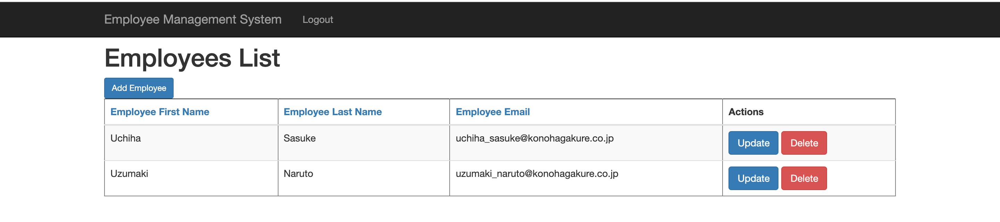

# employee-management
### Things todo list:
1. Clone this repository: `git clone https://github.com/hendisantika/employee-management.git`
2. Navigate to the folder: `cd employee-management`
3. Run the application: `mvn clean spring-boot:run`
4. Open your favorite browser: http://localhost:8080

### Images Screen shot
Registration Page

Login Page

Add New Employee

Employee List Page

